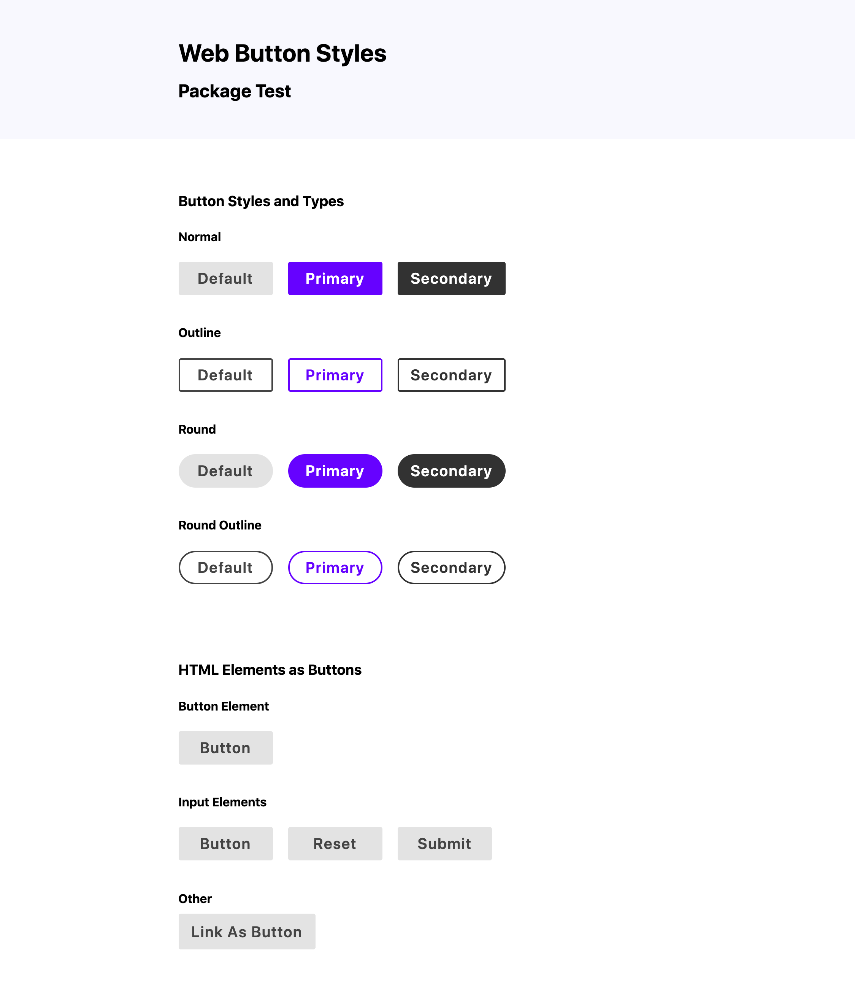
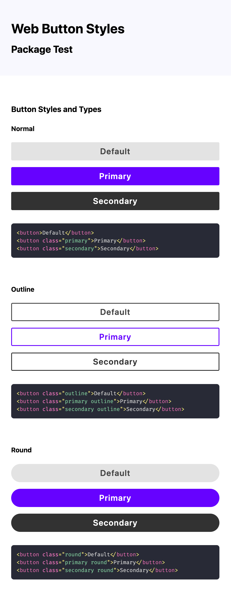

# web-button-styles [](https://travis-ci.com/github/mattdanielbrown/web-button-styles)

> ### *CSS and SCSS base styles for buttons, distributed as an NPM package.*

### On NPM: https://www.npmjs.com/package/web-button-styles

## Install

#### Via NPM:
```bash
npm install --save web-button-styles
```

#### Or via Yarn:
```bash
yarn add web-button-styles
```

## Usage

There are 2 main ways of using this package: in **CSS** or **SCSS**

If you're writing SCSS that will be compiled later using the Sass preprocessor, just import the **SCSS** file wherever you like:

```scss
@import "PATH/TO/node_modules/web-button-styles/web-button-styles";
```

Otherwise, if you're working with plain CSS, you can import either the *minified* stylesheet (`compiled-web-styles.min.css`):

```html
<!-- Probably in the <head> element: -->
<link rel="stylesheet" href="/PATH/TO/node_modules/web-button-styles/compiled-web-button-styles.min.css">
```

or the *unminified* stylesheet (`compiled-web-button-styles.css`)

```html
<!-- Probably in the <head> element: -->
<link rel="stylesheet" href="/PATH/TO/node_modules/web-button-styles/compiled-web-button-styles.css">
```

## Screenshots





